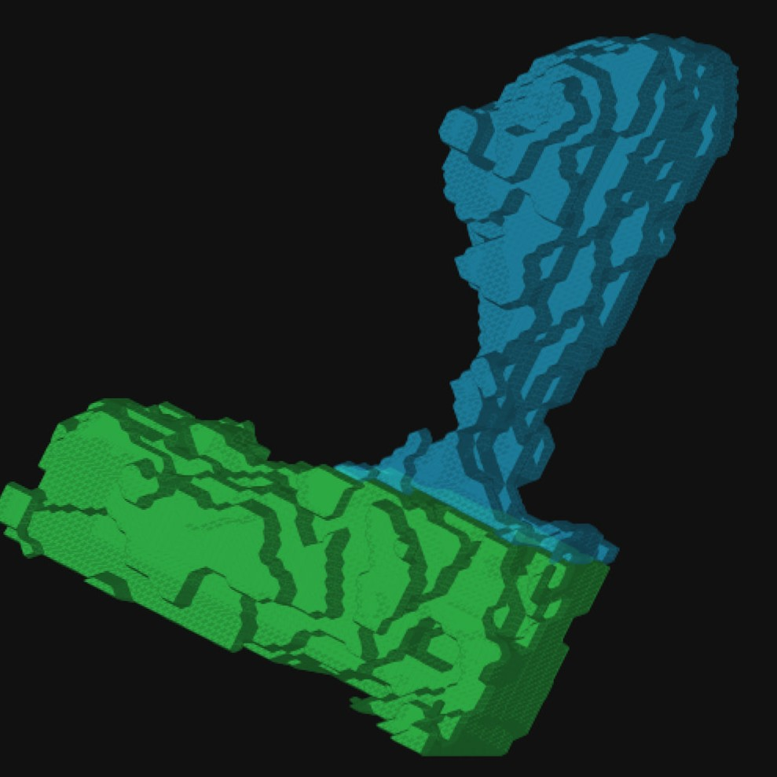

# Synpo Microscopy Processor

<p align="center">
  
</p>

Synpo is a Windows and macOS desktop application for processing paired-channel, 3D microscopy recordings of dendrites, dendritic spines, and protein clusters. It supports large batches from TIFF import through preprocessing, automatic 3D segmentation, optional guided correction, measurement, spine-distribution review, and Excel/CSV export.

This is the **0.8.0 beta release**. It is intended for supervised scientific use: review segmentation and centerline results before relying on exported measurements.

## Main features

- Imports registered, paired 16-bit TIFF Z-stacks with identical dimensions.
- Supports the original metadata filename schema, configurable channel markers such as `cy`/`cl`, and manually selected A/B files from the same or different folders.
- Organizes parsed specimens into experimental groups; metadata-free batches can use one editable fallback group.
- Applies adaptive per-stack background correction, threshold estimation, and Gaussian smoothing without modifying source TIFFs.
- Detects dendrites, closely touching spine candidates, and protein-cluster candidates in 3D.
- Automatically switches oversized specimens to slower disk-backed detection when the ordinary method would exceed the project's 80% RAM ceiling. A per-project setting can use low-memory detection for every specimen.
- Shows scrollable Z slices, XY/XZ/YZ maximum projections, linked orthogonal views, zoom/pan controls, and cropped rotatable 3D surfaces.
- Provides separate X/Y/Z rotation controls, adjustable Z-layer spacing, colors, and surface opacity for publication-oriented 3D snapshots.
- Accepts optional drawing hints for local resegmentation. Each missed-object hint produces a separate object whose boundary follows the preprocessed image signal.
- Measures dendrites, individual spines, and qualifying clusters. Intensity measurements always use the original 16-bit voxels.
- Measures protein distribution in ten equal-length parts along each spine's curved 3D centerline.
- Allows an optional point hint to correct the distal centerline endpoint while preserving the automatically detected base.
- Provides protein-cluster-positive and optional cluster-less spine review, invalid-spine exclusion, stable spine numbering, full-field context, and a filterable numbered spine map.
- Displays experimental-group distribution profiles with SEM error bars.
- Shows responsive batch progress bars with completed work, elapsed time, and a rough remaining-time estimate for preprocessing, detection, and measurement.
- Exports verified Excel and CSV tables, settings, audit information, and optional validation PDFs.

Synpo calculates measurements only. Perform statistical hypothesis testing in separate statistics software.

## Requirements

- Windows 10/11; macOS 12+ on Intel or Apple Silicon; or the separate legacy environment for Intel macOS 10.15 Catalina and macOS 11
- Anaconda, Miniconda, or Miniforge
- Sufficient free disk space for the compressed project cache, exports, and temporary low-memory detection data

Synpo is designed for ordinary laptop hardware and limits itself to at most 80% of available RAM. Large stacks are processed with a disk-backed Z-slab method that merges objects crossing slab boundaries. Synpo checks the required temporary space before starting each such specimen. If space is insufficient, that specimen remains retryable and the rest of the batch continues.

## Installation

The environment is named `synpo-microscopy`. Synpo never modifies a separate environment named `synpo`.

### Windows

Download or clone this repository and double-click `launch_synpo.bat`. It searches the active Conda installation, its saved choice, `PATH`, Conda's environment registry, the Windows registry, and common Anaconda, Miniconda, Miniforge, and Mambaforge locations. Custom installation directories and custom Conda `envs_dirs` are supported. If automatic discovery fails, select the Conda installation folder once; if the environment is missing, approve its creation when prompted.

The choice is saved in `%APPDATA%\Synpo\launcher-conda.txt`. Delete that file to select another installation. Manual setup is also available from an **Anaconda Prompt**:

```powershell
conda env create -f environment.yml
conda env update -n synpo-microscopy -f environment.yml --prune
launch_synpo.bat
```

To create a Synpo desktop shortcut with the supplied icon, run once:

```powershell
powershell -ExecutionPolicy Bypass -File .\scripts\create_desktop_shortcut.ps1
```

### macOS

The standard environment supports Intel and Apple Silicon Macs on macOS 12 or newer. A separate legacy environment supports Intel macOS 10.15 Catalina and macOS 11 on Intel or Apple Silicon. The legacy file pins Python 3.10 and the official PySide6 6.2.4 wheel, keeping it isolated from current systems.

In Terminal, make the launcher executable once and open it:

```bash
chmod +x launch_synpo.command
./launch_synpo.command
```

It can subsequently be opened from Finder. Like the Windows launcher, it discovers Conda and custom environment locations automatically, presents a native folder picker only when necessary, remembers the successful choice in `~/Library/Application Support/Synpo/launcher-conda.txt`, and offers to create the OS-appropriate environment. If macOS blocks this unsigned beta script, right-click it, choose **Open**, and confirm once; do not disable Gatekeeper globally.

Catalina users need the archived [Miniforge release that supports macOS 10.13-10.15](https://github.com/conda-forge/miniforge/releases/tag/26.1.1-3). Catalina dependency resolution has been verified; final application and representative-dataset testing must be performed on a Catalina Mac before treating that path as field-validated.

## Importing TIFF files

All recordings must be registered 3D stacks. The two files in a specimen pair must have identical dimensions.

Synpo supports three import methods.

### Original metadata filenames

```text
<batch prefix>_<experimental group>_<specimen ID>_ChanA_registered.tif
<batch prefix>_<experimental group>_<specimen ID>_ChanB_registered.tif
```

### Configurable channel markers

Enter the marker used for each channel before scanning a folder. For example, markers `cy` and `cl` pair:

```text
Untitled001cy.tif
Untitled001cl.tif
```

When the other metadata fields are absent, the batch is placed in the selected fallback experimental group and the paired filename becomes the editable specimen name. The `_registered` flag is optional in this mode.

### Manual pairing

Select **Manually choose one Channel A file and one Channel B file** to pair two individual TIFFs. The files may be in different folders. Synpo stores and verifies each source path independently; relinking can search a selected parent folder and its subfolders.

Channel roles are confirmed for every batch. By default, Channel A contains protein clusters and Channel B contains dendrites and spines. Always confirm the XY pixel size and Z step when starting a project; TIFF calibration metadata can be overridden and named presets reused.

## Typical workflow

1. Select and scan a TIFF folder, or manually choose one channel pair.
2. Confirm channel markers and roles, voxel calibration, experimental groups, specimen names, and output location.
3. Tune preprocessing on representative specimens. Mark unusual pairs for saved
   per-pair ChanA/ChanB overrides when they need different parameters.
4. Preprocess the entire batch and run automatic detection.
5. Review detected specimens and optionally apply local corrections.
6. After at least one specimen is marked manual-review complete, calculate its
   measurements and begin protein-cluster-positive spine review.
7. Optionally review cluster-less spines and exclude invalid detections.
8. Export the workbook, CSV tables, and any requested validation PDFs.

Automatic checkpoints are written throughout preprocessing, detection, correction, and measurement. Completed specimens remain available if a later batch operation is cancelled or interrupted.

Detection uses **Automatic (fast when safe)** by default. Choose **Always use low-memory detection** in Stage 3 to use the disk-backed method for every pending specimen in that project. This execution choice does not invalidate completed masks. Detection reports completed, low-memory, skipped, and failed specimens separately; skipped or failed specimens are retried when the batch is run again.

## Review and visualization

The correction canvas can show an individual Z slice or a drawable XY maximum projection. Drawn hints are instructions rather than final masks. The brushes are:

- **Add — green:** draw separately inside each missed object; each stroke seeds an independent 3D object whose boundary follows preprocessed signal.
- **Exclude — red:** touch an unwanted object to remove that complete 3D object.
- **Trim — magenta:** draw across excess segmentation; Synpo removes the hint and keeps the largest connected remainder.
- **Expand — blue:** draw from an existing object toward missed signal so its boundary is regrown locally.
- **Split — yellow:** draw through a neck or contact to divide one object into separately numbered objects.
- **Mark as filopodium — purple:** touch a spine to exclude it and record the filopodium decision in the audit trail.
- **Merge objects — `#ED6291`:** draw through at least two objects to combine them under one stable ID.
- **Accept — cyan:** retain the mask unchanged and record the object as accepted.
- **Needs attention — orange:** retain the mask unchanged and explicitly flag it for later review.

Multiple missed-object hints remain separate objects. Protein clusters are detected automatically and are not manually redrawn.

Correction uses ordinary RAM when safe and automatically switches oversized edits to slower disk-backed processing. An **Always use slow low-memory correction** option is available for low-RAM computers, with undo retained in both modes.

Maximum projections and 3D context are available during detection and correction. Their progress and Cancel control appear in the bottom status line instead of a modal popup. Before creating a 3D surface, select a rectangular area on the XY projection to control memory use. Dendrite and spine surfaces can be translucent while protein clusters remain opaque. Colors, opacity, rotation on all three axes, and displayed Z spacing are adjustable; these display settings never alter masks or measurements.

## Spine distribution review

Protein-cluster-positive spines are divided voxel-by-voxel into ten parts along a calibrated curved centerline from the shaft contact to the distal endpoint. For each part, Synpo saves spine volume, inside-cluster volume, and their ratio.

If the automatic centerline endpoint is correct, no action is required. Otherwise:

1. Select **Centerline end hint**.
2. Use the cropped Z viewer, whose slider is limited to slices occupied by that spine.
3. Click the desired distal endpoint on the spine.

The point snaps to the nearest voxel belonging to the selected spine, the centerline is rebuilt from the automatic base, and the review returns to the maximum projection. **Clear end hint** restores automatic endpoint detection.

Clicking either cropped channel view opens the full-specimen projection with the current spine highlighted by a thick bright-green outline; other spines use thick cyan outlines. **Open numbered spine map** shows all stable spine IDs with zoom, optional single-Z viewing, and filters for cluster-positive, cluster-less, valid, or invalid spines.

Cluster-less spine review is optional and never blocks export. Marking a spine invalid excludes it from all subsequent metrics, including spine density and the protein-inclusion percentage denominator, while preserving an auditable decision row.

## Results

Partial export is allowed: only pairs with completed measurement checkpoints are
included, and the measurement panel reports how many unfinished pairs were omitted.

The verified export contains:

- Master specimen-, dendrite-, spine-, and cluster-level measurements.
- One row per individual included cluster plus per-spine cluster sums.
- Individual ten-part protein distributions for every qualifying spine.
- Specimen and experimental-group summaries with counts, means, variability, inclusion percentages, and SEM profiles.
- Excluded-distribution, invalid-spine, and spine-review audit tables.
- Calibration, measurement, and distribution settings.
- Optional two-panel PDF pages showing reviewed spines and distribution profiles.

Source TIFFs are never modified. The compressed project cache can be removed after final export has been verified.

## Beta-release notes

- Windows and macOS launchers discover Conda installations and environments in nonstandard folders; successful choices are remembered per user.
- The macOS launcher is Conda-backed rather than a signed/notarized `.app`. Catalina dependency resolution is verified, but Catalina and Apple Silicon field testing remain in progress.
- Closely touching structures and unusual morphology may require review or correction.
- Filopodia are retained as candidates and can be excluded during review.
- Automatically retained somata and axons should be removed with the correction tools.
- Remaining-time estimates are approximate and stabilize after several slices or specimens.
- Segmentation-mask and ImageJ ROI ZIP export are not yet included in this beta release.
- Report problems or suggestions through this repository's GitHub Issues page.
